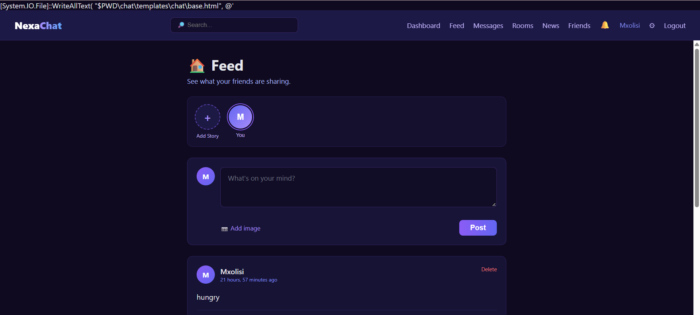
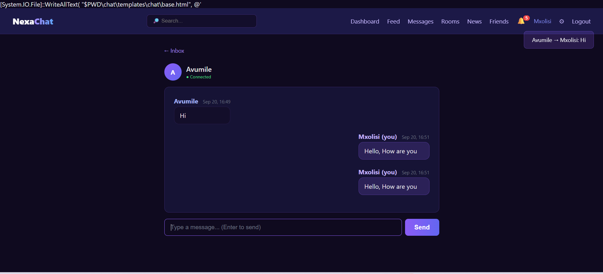

<div align="center">

# 💬 NexaChat

### Real-time messaging & social platform

**Connect. Chat. Communicate.**

[](https://nexachat-9cfg.onrender.com)
[](https://github.com/mxolisi78/NexaChat/actions/workflows/tests.yml)
[](LICENSE)

[](https://python.org)
[](https://djangoproject.com)
[](https://channels.readthedocs.io)
[](https://postgresql.org)
[](https://redis.io)
[](Dockerfile)

</div>

---

## 📖 About

**NexaChat** is a full-stack, real-time social messaging platform built with **Django**, **Channels**, and **WebSockets**. It combines public chat rooms, private direct messages, a friend system, a post feed, 24-hour stories, live notifications, and a token-authenticated REST API — all deployed to production with Docker, PostgreSQL, and Redis.

Built as a portfolio project to demonstrate modern backend engineering: async WebSockets, message brokering, cloud database management, CI/CD, and production deployment.

---

## ✨ Features

<table>
<tr>
<td width="50%" valign="top">

### 💬 Real-Time
- **Public chat rooms** with WebSocket broadcast
- **1-on-1 direct messages** (friends only)
- **Live notifications** — bell badge, toast popups
- **Online status** — green dot for active users
- **Join/leave** notifications
- **Typing persistence** to DB

### 👥 Social
- **Friend requests** — send, accept, decline
- **Friend list** with suggestions
- **Posts** with images
- **Likes & comments**
- **24-hour stories** with viewer
- **User profiles** — avatar, bio, location

</td>
<td width="50%" valign="top">

### 🌐 Platform
- **Global search** — users, rooms, posts
- **REST API** with token auth
- **News feed** — GNews API with caching
- **Admin analytics** dashboard
- **Reporting & moderation** system
- **Responsive design** — mobile ready

### 🔒 Infrastructure
- **Docker** + compose stack
- **PostgreSQL** (production)
- **Redis** channel layer
- **GitHub Actions** CI
- **Whitenoise** static files
- **Production security** (HSTS, CSRF, SSL)

</td>
</tr>
</table>

---

## 📸 Screenshots

### 🏠 Feed with stories & posts


### 💬 Real-time chat room


### 📊 Admin analytics dashboard


---

## 🏗️ Architecture
┌─────────────────────────────────────────────────────────────┐
│ Browser │
│ ┌──────────────┐ ┌──────────────┐ ┌──────────────┐ │
│ │ HTTP pages │ │ WebSockets │ │ REST API │ │
│ │ /feed /rooms │ │ /ws/chat │ │ /api/... │ │
│ │ /dm /stories │ │ /ws/dm │ │ Token auth │ │
│ │ │ │ /ws/notif │ │ │ │
│ └──────┬───────┘ └──────┬───────┘ └──────┬───────┘ │
└─────────┼─────────────────┼─────────────────┼───────────────┘
│ │ │
▼ ▼ ▼
┌─────────────────────────────────────────────────────────────┐
│ Daphne (ASGI) + Django + Channels │
│ ┌──────────┐ ┌──────────┐ ┌──────────┐ ┌──────────┐ │
│ │ Views │ │ Consumers│ │ Signals │ │ DRF │ │
│ │ │ │ Chat/DM │ │ Notifs │ │ Views │ │
│ │ │ │ Notif │ │ │ │ │ │
│ └────┬─────┘ └────┬─────┘ └────┬─────┘ └────┬─────┘ │
│ └─────────────┴─────────────┴─────────────┘ │
│ │ │
│ ▼ │
│ ┌───────────────────────────────────────────┐ │
│ │ Channel Layer (Redis / Upstash) │ │
│ └───────────────────────────────────────────┘ │
│ │ │
│ ▼ │
│ ┌───────────────────────────────────────────┐ │
│ │ PostgreSQL (Neon) │ │
│ │ 12 models: Users, Rooms, Messages, │ │
│ │ Friends, DMs, Posts, Likes, Comments, │ │
│ │ Stories, Notifications, Reports, News │ │
│ └───────────────────────────────────────────┘ │
└─────────────────────────────────────────────────────────────┘
│
▼
┌──────────────┐
│ GitHub │
│ Actions CI │
└──────────────┘

text

---

## 🛠️ Tech Stack

### Backend
| Technology | Purpose |
|---|---|
| **Python 3.13** | Language |
| **Django 6.1** | Web framework |
| **Django Channels 4** | Async WebSocket support |
| **Daphne** | ASGI server |
| **Django REST Framework** | API layer |
| **python-decouple** | Environment config |

### Data
| Technology | Purpose |
|---|---|
| **PostgreSQL 17** (Neon) | Primary database |
| **Redis 7** (Upstash) | Channel layer / message broker |
| **SQLite** | Local fallback for dev |

### Frontend
| Technology | Purpose |
|---|---|
| **HTML5 / CSS3** | Layout & styling |
| **Vanilla JavaScript** | WebSocket client |
| **CSS Grid / Flexbox** | Responsive layout |
| **Native Fetch API** | Notification polling |

### Infrastructure
| Technology | Purpose |
|---|---|
| **Docker** | Containerization |
| **Docker Compose** | Multi-service orchestration |
| **GitHub Actions** | CI pipeline |
| **Render** | Production hosting |
| **Whitenoise** | Static file serving |

---

## 🚀 Quick Start

### Option 1 — Docker (recommended)

The fastest way. Spins up Django + PostgreSQL + Redis with one command.

```bash
git clone https://github.com/mxolisi78/NexaChat.git
cd NexaChat
docker compose up --build
Then visit http://127.0.0.1:8000/

Create an admin user:

bash
docker compose exec web python manage.py createsuperuser
Option 2 — Native (local Python)
bash
# 1. Clone & install
git clone https://github.com/mxolisi78/NexaChat.git
cd NexaChat

python -m venv venv
source venv/bin/activate         # macOS/Linux
# venv\Scripts\activate          # Windows

pip install -r requirements.txt

# 2. Configure
cp .env.example .env
# Edit .env and add your own keys

# 3. Migrate & run
python manage.py migrate
python manage.py createsuperuser
python manage.py runserver
🔧 Environment Variables
Copy .env.example to .env and fill in:

Variable    Required    Description
SECRET_KEY    ✅    Django secret key (long random string)
DEBUG    ✅    True for dev, False for production
ALLOWED_HOSTS    ✅    Comma-separated hostnames
DATABASE_URL    ⭕    Postgres URL (leave empty for SQLite)
REDIS_URL    ⭕    Redis URL (leave empty for InMemory)
GNEWS_API_KEY    ⭕    Free key from gnews.io
CSRF_TRUSTED_ORIGINS    ⭕    Comma-separated origins
🧪 Testing
bash
python manage.py test chat --verbosity=2
Test coverage:

Layer    What's tested
Models    Slug generation, ordering, cascades, __str__
Views    Auth redirect, room list, room detail, POST handling
API    Register, login, token auth, permission enforcement
WebSockets    Connect, broadcast, DB persistence, empty rejection
CI runs the full suite on PostgreSQL + Redis via GitHub Actions on every push.

🔌 REST API
Token-authenticated REST API — browsable in the browser at /api/.

Auth
http
POST   /api/auth/register/     # Create user, return token
POST   /api/auth/login/        # Get token
POST   /api/auth/logout/       # Invalidate token
GET    /api/auth/me/           # Current user
Content
http
GET    /api/rooms/                       # List rooms
POST   /api/rooms/                       # Create room
GET    /api/rooms/<slug>/                # Room detail
GET    /api/rooms/<slug>/messages/       # Message history
POST   /api/rooms/<slug>/messages/       # Post message
Authentication:

http
Authorization: Token abc123def456...
Example:

bash
curl -X POST https://nexachat-9cfg.onrender.com/api/auth/login/ \
  -H "Content-Type: application/json" \
  -d '{"username":"mxolisi","password":"yourpassword"}'

# Response: {"token": "abc123...", "user": {...}}
📁 Project Structure
text
NexaChat/
├── 📄 README.md
├── 📄 Dockerfile
├── 📄 docker-compose.yml
├── 📄 build.sh
├── 📄 render.yaml
├── 📄 requirements.txt
├── 📄 .env.example
├── 📄 .gitignore
│
├── 📁 .github/workflows/
│   └── tests.yml                    # CI pipeline
│
├── 📁 docs/screenshots/             # README screenshots
│
├── 📁 nexachat/                     # Project config
│   ├── settings.py                  # Dev + prod config
│   ├── urls.py
│   ├── asgi.py                      # HTTP + WebSocket routing
│   └── wsgi.py
│
└── 📁 chat/                         # Main app
    ├── models.py                    # 12 models
    ├── views.py                     # Auth, rooms, news
    ├── friend_views.py              # Friend system
    ├── post_views.py                # Feed, posts, likes, comments
    ├── dm_views.py                  # Direct messages
    ├── story_views.py               # 24h stories
    ├── notification_views.py        # Notification API
    ├── report_views.py              # Moderation
    ├── search_views.py              # Global search
    ├── profile_views.py             # Profiles + settings
    ├── consumers.py                 # WebSocket: chat + DM
    ├── notification_consumer.py     # WebSocket: notifications
    ├── signals.py                   # Auto-notification hooks
    ├── routing.py                   # WebSocket URL map
    ├── serializers.py               # DRF serializers
    ├── api_views.py                 # REST endpoints
    ├── admin_dashboard.py           # Custom admin KPIs
    ├── news_service.py              # GNews integration
    ├── forms.py                     # 9 forms
    ├── admin.py                     # Admin registration
    ├── tests.py                     # ~21 tests
    ├── test_websockets.py           # 3 async tests
    ├── migrations/
    └── templates/chat/              # 20+ templates
🎯 Roadmap
☑ User authentication
☑ Public chat rooms with WebSockets
☑ Direct messages
☑ Friend system
☑ Posts, likes, comments
☑ 24-hour stories
☑ Real-time notifications
☑ Global search
☑ Reporting & moderation
☑ Admin analytics dashboard
☑ REST API with token auth
☑ PostgreSQL migration
☑ Redis channel layer
☑ Docker + docker-compose
☑ GitHub Actions CI
☑ Production deployment
□ Message reactions (👍❤😂)
□ Typing indicators
□ Read receipts
□ Voice/video calls (WebRTC)
□ Mobile app (React Native)
□ End-to-end encryption
🚀 Deployment
NexaChat is deployed on Render with:

Hosting: Render free tier

Database: Neon.tech PostgreSQL (Cape Town region)

Redis: Upstash (Cape Town region)

Static files: Whitenoise

SSL: Automatic via Render

Deploy your own:

Fork this repo

Sign up at render.com

New → Web Service → connect your fork

Set environment variables from .env.example

Deploy

The render.yaml file provides Infrastructure-as-Code.

🤝 Contributing
Pull requests welcome. For major changes, please open an issue first.

Fork the repo

Create a feature branch (git checkout -b feature/amazing)

Commit changes (git commit -m 'Add amazing feature')

Push to branch (git push origin feature/amazing)

Open a Pull Request

📄 License
MIT — see LICENSE for details.

🙏 Acknowledgements
Django & Django Channels

Neon — serverless Postgres

Upstash — serverless Redis

Render — hosting

GNews — news API

<div align="center">
Built with 💜 by Mxolisi

⭐ Star this repo if you found it useful!

</div> '@, [System.Text.UTF8Encoding]::new($false) ) ```
